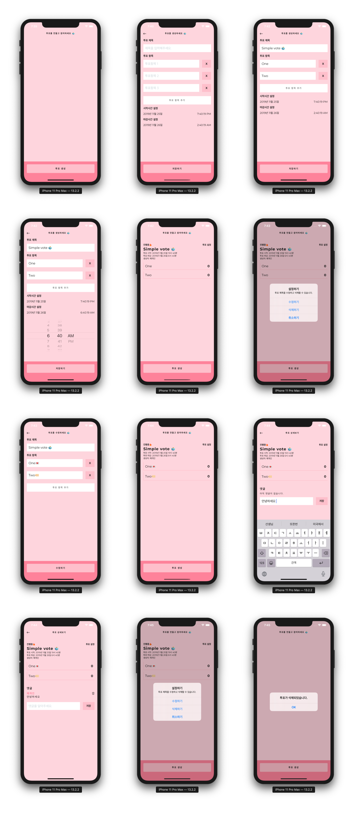

# voteApp

간단한 투표 앱입니다. 투표를 생성하고 투표에 참여할 수 있습니다.

### 기능

1. 구글 로그인
2. 투표 생성 (제목 입력, 기본으로 투표 항목 3개 생성, 투표 항목 10개까지 추가 가능, 시간 설정 가능)
3. 투표 수정 기능 (제목과 항목들)
4. 투표 삭제 가능
5. 투표 리스트 (제목, 생성자, 기간, 진행 중 여부 확인)
6. 투표 상세 보기 (상세보기에서는 댓글을 작성하고 볼 수 있음)
7. 댓글 작성 기능 추가 (댓글은 투표 중일때만 작성 가능, 댓글 삭제 가능)
8. 투표 가능
9. 투표 결과 확인 가능
10. 종료시간이 지난 투표는 결과보기만 가능

### stack

- ignite boilerplate
  - react native 0.61.2
  - react navigation v3
  - typescript
- firebase
  1. firebase authentication
  2. firebase realtime database
  3. firebase crashlytics

### 미리보기

